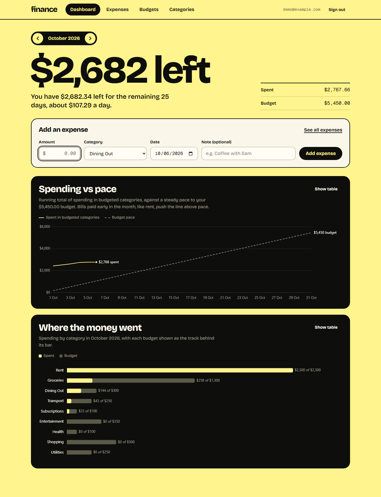

# Finance: a personal finance dashboard

Log expenses, set a monthly budget for each category, and see where the month went.

**Live demo: https://finance-dashboard-three-virid.vercel.app**. Click **Use demo account** for three months of sample data.

React · TypeScript · Supabase (Postgres, RLS, SQL functions) · Chart.js · Playwright · Vercel

The app lives in [`finance-dashboard/`](finance-dashboard). Read [its README](finance-dashboard/README.md) for what it demonstrates, the modelling decisions, and how to run and test it, and [`docs/ARCHITECTURE.md`](finance-dashboard/docs/ARCHITECTURE.md) for the C4 diagrams and data model.
