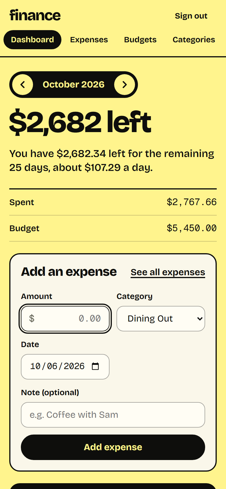
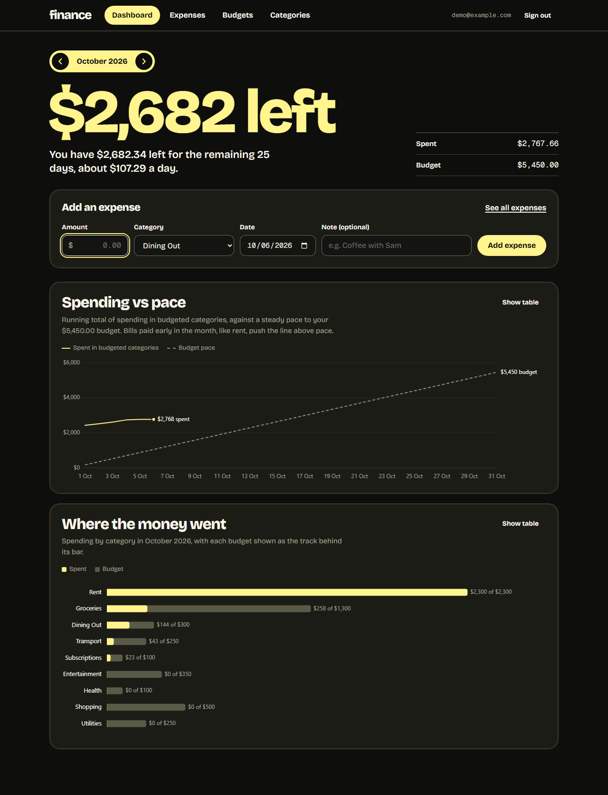
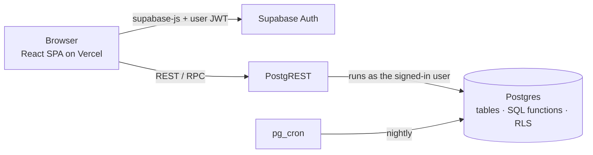

# Finance

Log expenses, set a monthly budget for each category, and see where the month went.

**Live demo: https://finance-dashboard-three-virid.vercel.app**. Click **Use demo account** for three months of sample data (resets nightly), or create your own account.


<p>
  
  
</p>

## What it does

- **Expenses:** quick-add (the amount field is focused, Enter submits, and category and date stick between entries), filter by month and category, edit and delete in place.
- **Budgets:** a limit per category per month, saved as you leave each field. "Copy from last month" fills an empty month.
- **Categories:** add, rename, recolour. Deleting a category that has expenses asks where to move them, then moves and deletes in one transaction.
- **Dashboard:** the month's key fact as a headline ("$2,682 left", plus a daily allowance), a running-total-vs-pace line chart, and spending by category with each budget as a track behind its bar. Every chart has a table view.
- **Everywhere:** light and dark themes, works down to 320px wide, no WCAG 2.1 A/AA violations (checked by axe in the end-to-end tests).

## What this project demonstrates

| Goal | Where to look |
|---|---|
| **Data modelling** | Postgres schema with integer-cent money, owner-checked composite foreign keys, and constraints in the database rather than the UI. Row Level Security is the only security boundary, since the browser talks straight to the database. See [`supabase/migrations`](supabase/migrations) and the 47 [pgTAP tests](supabase/tests). |
| **Charts** | Two Chart.js charts, each answering one question, built to a written dataviz method: contrast-checked palette, one hue for nominal categories, reserved colour plus label for over-budget, values at the bar tips, a table view, and dark mode. Chart.js loads lazily. See [`src/components/charts`](src/components/charts). |
| **Usable UI** | Keyboard-first forms, visible focus, empty and error states that say what to do, layouts restructured (not just shrunk) for phones, and the previous month dimmed rather than a skeleton flash on month changes. |
| **Raw data → product** | SQL aggregation (`monthly_category_summary`, `daily_spend`) feeds pure, unit-tested functions ([`src/lib/dashboard.ts`](src/lib/dashboard.ts)) that turn rows into the headline and chart series. The headline only states exact arithmetic: no straight-line projections, because rent paid on the 1st would make them cry wolf every month. |

## Architecture



There's no custom backend. Each request runs as the signed-in user, and Postgres policies restrict every query to that user's rows. Logic that has to be trustworthy (ownership, validation, aggregation, multi-row changes) lives in the database. Full write-up with C4 diagrams, data model and flows: [`docs/ARCHITECTURE.md`](docs/ARCHITECTURE.md).

### Modelling decisions

| Decision | Why |
|---|---|
| `amount_cents bigint`, never floats | Exact arithmetic. Formatting happens only at the UI edge. |
| `spent_on date`, not a timestamp | An expense happens on a calendar day. A UTC timestamp would move late-night expenses into the wrong day or month. |
| Budget `month` is always the 1st, enforced by a CHECK | One canonical value to join and index on. |
| `unique (user_id, month, category_id)` on budgets | Exactly one budget per category per month, so the UI can upsert. |
| Composite FK `(category_id, user_id) → categories(id, user_id)` | FK checks bypass RLS, so this is what stops an expense pointing at someone else's category. |
| `user_id default auth.uid()` | The client never sends `user_id`, so it can't spoof it. |
| `on delete no action` (not `restrict`) for category → expenses | Both block deleting a category in use, but `restrict` would also break deleting a user, whose cascade removes categories before their expenses. |
| Delete-with-reassign and copy-budgets are SQL functions | Each is one transaction: no half-moved expenses, and no unique-constraint failures from stale UI state. |
| Spending in unbudgeted categories never counts as "over budget" | No budget was set for it to exceed. The pace chart and headline use the same rule. |

## Tech stack

React 19 · TypeScript · Vite 8 · TanStack Query · React Router · Chart.js · zod · Supabase (Postgres 17, Auth, PostgREST, pg_cron) · Vitest · pgTAP · Playwright + axe · Vercel

## Running it locally

Needs Node 24+ and Docker Desktop.

```sh
npm install
npm run db:start           # local Supabase: Postgres, Auth, API gateway (applies migrations + seed)
cp .env.example .env.local # local-stack defaults; db:start prints the URL and key if they differ
npm run dev                # http://localhost:5173. Use the demo button or sign up.
```

## Tests

```sh
npm test            # 97 unit tests (Vitest): money, dates, budgets, dashboard maths
npm run db:test     # 47 database tests (pgTAP): constraints, RLS isolation, SQL functions, demo account
npm run test:e2e    # 19 browser tests (Playwright): every flow, phone layouts, axe accessibility scans
npm run build       # type-checks app, config and e2e code, then builds
npm run lint        # oxlint
```

The e2e tests run against the local stack, so start it first with `npm run db:start`.

## Deployment

- **Front end:** Vercel builds `finance-dashboard/` on every push to `main`. `vercel.json` adds SPA rewrites so deep links work.
- **Database:** a hosted Supabase project. Schema changes are migrations, tested locally and applied with `npx supabase db push --linked`.
- **Demo account:** public on purpose. A trigger keeps its email and password from being changed, and pg_cron rebuilds its data every night relative to the current date.

## Project layout

```
src/
  lib/          pure logic + unit tests (money, dates, budgets, dashboard)
  hooks/        TanStack Query hooks: the only code that talks to Supabase (with src/auth)
  components/   forms, tables, month picker, charts/ (Chart.js lives only in *Canvas.tsx)
  pages/        one per route, lazy-loaded
supabase/
  migrations/   schema, RLS, SQL functions, demo account
  tests/        pgTAP
e2e/            Playwright specs
docs/           ARCHITECTURE.md, screenshots
```
