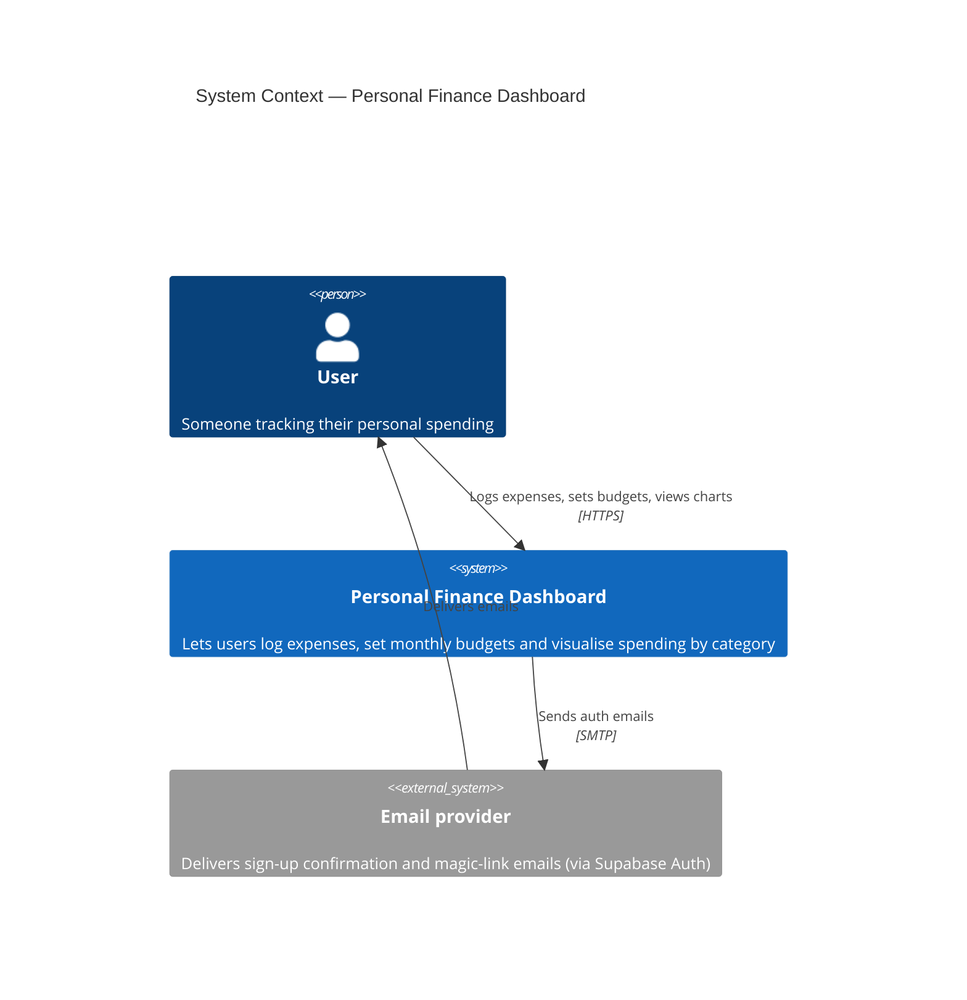
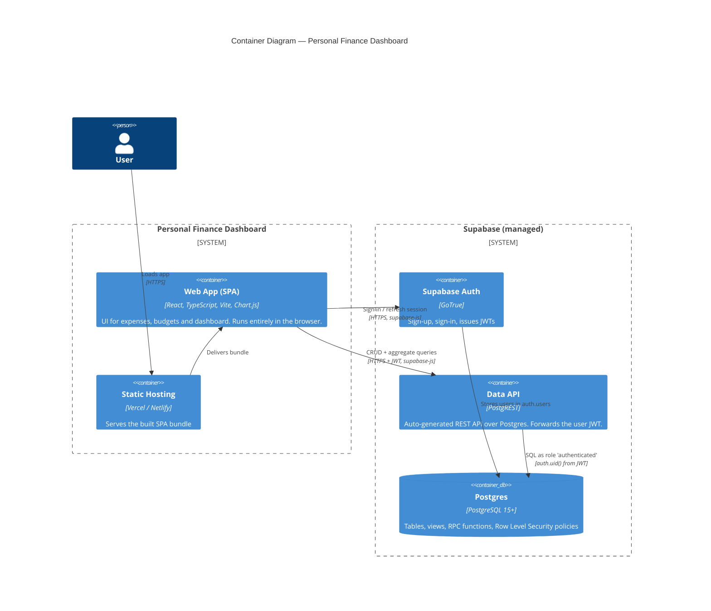
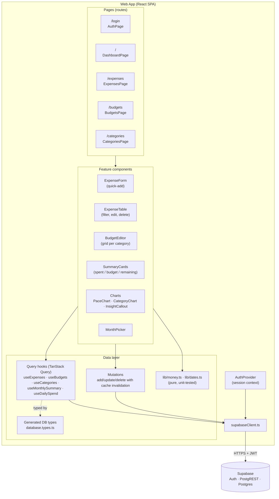
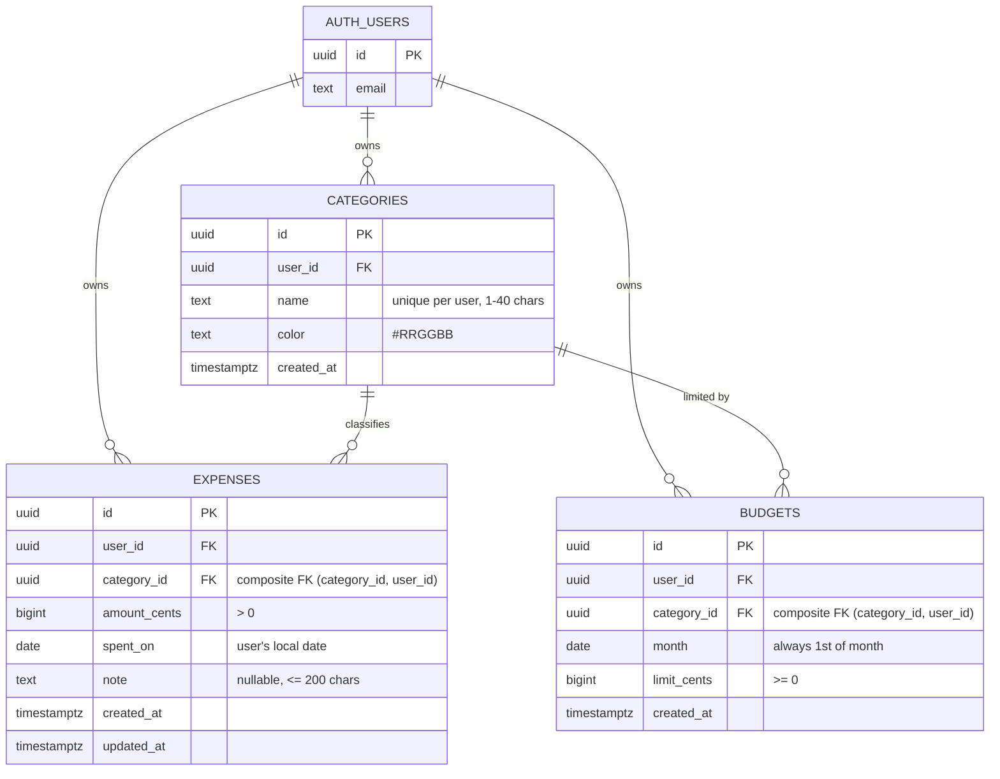
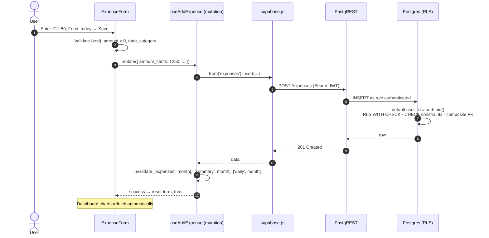
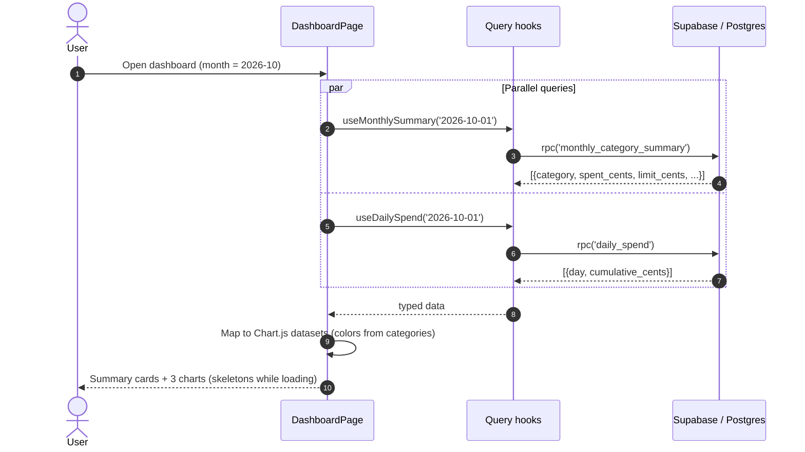
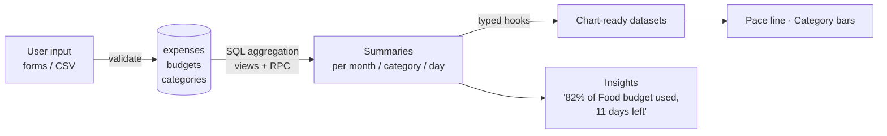

# Personal Finance Dashboard — Architecture & Plan

Track expenses, set monthly budgets per category, and see where the money goes.

**Stack:** React 19 + TypeScript (Vite) · Supabase (Postgres, Auth, RLS) · Chart.js (via `react-chartjs-2`)

**What this project is meant to demonstrate**

| Goal | How the project proves it |
|---|---|
| Data modelling | Normalised schema, integer money, composite FKs that enforce ownership, RLS, constraints in the database rather than only in the UI |
| Charts | Three chart types, each answering a specific question, all fed from one SQL aggregation layer |
| Usable UI | Adding an expense takes under 5 seconds, plus empty states, loading/error states, keyboard-friendly forms, and a responsive layout |
| Raw data → product | Raw transactions go through SQL views to typed hooks and then to insights ("You're 82% through your Food budget with 11 days left") |

---

## 1. Requirements

### Functional (MVP)
1. Sign up / sign in (email magic link or email + password).
2. Manage categories (name + colour). New users get a default set.
3. Add / edit / delete expenses (amount, date, category, optional note).
4. Set a budget per category per month.
5. Dashboard for a selected month:
   - total spent vs total budget
   - spend by category (doughnut)
   - budget vs actual per category (horizontal bar)
   - cumulative daily spend vs "on-pace" line (line)
6. Expense list with filter by month and category.

### Non-functional
- **Security:** every row belongs to a user, enforced by Postgres RLS rather than client code.
- **Correctness:** money stored as integer cents, with no floating-point drift.
- **Performance:** aggregation happens in SQL, so the client never downloads every row just to sum it.
- **Type safety:** DB types generated from the schema (`supabase gen types`), so the code and the database can't drift apart.

### Stretch (after MVP)
- CSV import of bank statements, with column mapping and duplicate detection. This is the strongest "raw data → product" story.
- Recurring expenses (rent, subscriptions).
- Month-over-month trend chart.
- Over-budget alerts.

---

## 2. System Context — C4 Level 1



---

## 3. Containers — C4 Level 2



**Key architectural decision: no custom backend.** The SPA talks directly to Supabase. That is only safe because **RLS is the security boundary**: each request runs as the signed-in user, and Postgres policies restrict every query to `user_id = auth.uid()`. Business logic that has to be trustworthy (constraints, aggregation, ownership checks) lives in the database.

---

## 4. Components — C4 Level 3 (Web App)



**Responsibilities**
- **Pages** handle composition and routing only. No data fetching logic lives here.
- **Query hooks** are the *only* place that calls Supabase. Components never import `supabaseClient` directly, which keeps them testable and swappable.
- **`lib/`** holds pure functions (cents ↔ display, month boundaries, pace calculation) and gets 100% unit-test coverage.
- **Charts** take already-shaped data as props. They don't fetch, and they don't aggregate.

---

## 5. Data Model



### Modelling decisions (these make good interview talking points)

| Decision | Why |
|---|---|
| `amount_cents bigint` rather than `numeric`/`float` | Avoids floating-point rounding. Integer maths is exact, and formatting happens only at the UI edge. |
| `spent_on date` rather than `timestamptz` | An expense happens on a calendar day in the user's life. Storing a UTC timestamp would move late-night expenses into the wrong day or month. |
| `budgets.month date` with `check (month = date_trunc('month', month))` | One canonical value per month, so it's easy to join and index. |
| `unique (user_id, category_id, month)` on budgets | Exactly one budget per category per month. Lets the UI use `upsert`. |
| **Composite FK** `(category_id, user_id) → categories(id, user_id)` | Makes it *impossible* for user A's expense to reference user B's category, even if RLS were misconfigured. Requires `unique (id, user_id)` on categories. |
| `user_id default auth.uid()` | The client never sends `user_id`, so it can't spoof it. |
| `on delete restrict` for category → expenses | Deleting a category with history is a UI decision ("reassign to…?"), not a silent cascade. |
| Index `expenses (user_id, spent_on desc)` | Matches the main access pattern: "this user's expenses this month, newest first." |
| RLS on every table | Security boundary for a backend-less architecture. |

### Aggregation layer (raw data → product)

Charts read from **views / RPC functions** rather than raw tables:

| Object | Returns | Feeds |
|---|---|---|
| `monthly_category_summary(p_month date)` | category, color, spent_cents, limit_cents, remaining_cents, pct_used | Budgets page (spent per category) |
| `daily_spend(p_month date)` | day, spent_cents, cumulative_cents | Pace line chart |
| `monthly_totals(p_from, p_to)` (stretch) | month, spent_cents | Month-over-month trend |

These run as `security invoker`, so RLS still applies. They use `left join` so a category with a budget and zero spend still shows up, which is the case that tends to get missed.

---

## 6. Key Flows

### 6.1 Add an expense



### 6.2 Load the dashboard



### 6.3 Data flow overview



---

## 7. Charts — what each one answers

| Chart | Question it answers | Notes |
|---|---|---|
| **Line** — cumulative spend vs pace | "How is my spending tracking against my budget?" | Running total of spending in *budgeted* categories (same rule as the summary cards) against a dashed straight line from 0 to the total budget. Without budgets it shows all spending, single series. Crosshair tooltip, end labels. |
| **Horizontal bar** — where the money went | "Where did my money go, and which categories are over?" | One hue for every bar (the categories are nominal, so colour isn't spent on identity), sorted by spend. Each budget is a lighter track behind its bar (meter form). Over-budget bars switch to the reserved critical colour and get an "over by" label. Values at the bar tips; no value axis. |
| **Insight** — one sentence | "So what?" | Exact arithmetic only: budget left and a daily allowance, or how far over. No straight-line projections, because bills that land on one day (rent on the 1st) would trigger false alarms every month. |
| *(stretch)* Stacked bar — last 6 months | "Is my spending trending up?" | |

**Changed from the original plan:** a doughnut for spend by category was dropped. With 10 categories in user-chosen colours, no palette check can guarantee the slices are distinguishable, and the dataviz guidelines cap doughnuts at about 6 segments. Spend by category and budget vs actual were merged into the single bar chart above.

Every chart has a table view (the accessible equivalent), a text alternative on the canvas, and dark-mode colours of its own. Chart.js loads lazily, so it only downloads when a chart renders.

---

## 8. Proposed project structure

```
finance-dashboard/
├─ docs/ARCHITECTURE.md
├─ supabase/
│  ├─ config.toml          # local stack config (supabase init)
│  ├─ migrations/          # each table ships with its RLS policies
│  │  ├─ 20261006000001_categories.sql
│  │  ├─ 20261006000002_expenses_budgets.sql
│  │  ├─ 20261006000003_default_categories.sql
│  │  ├─ 20261006000004_summary_functions.sql
│  │  ├─ 20261007000001_delete_category.sql
│  │  ├─ 20261007000002_copy_budgets.sql
│  │  └─ 20261008000001_daily_spend_budgeted.sql
│  ├─ tests/               # pgTAP: constraints, RLS isolation, aggregates, RPCs
│  └─ seed.sql             # demo user + 3 months of data (dates relative to today)
├─ src/
│  ├─ lib/
│  │  ├─ supabaseClient.ts
│  │  ├─ database.types.ts # generated
│  │  ├─ money.ts          # cents <-> display, Intl.NumberFormat
│  │  ├─ dates.ts          # local ISO dates, month math
│  │  ├─ expenseForm.ts    # zod validation -> ExpenseInput
│  │  └─ dbErrors.ts       # SQLSTATE -> user-facing message
│  ├─ auth/                # AuthProvider, useAuth, RequireAuth, sign-in/out
│  ├─ hooks/               # useExpenses, useBudgets, useMonthlySummary, ...
│  ├─ components/          # ExpenseForm, ExpenseTable, MonthPicker, charts/...
│  ├─ pages/               # Dashboard, Expenses, Budgets, Categories, Login
│  └─ App.tsx              # router + providers
├─ .env.example            # template, committed
└─ .env.local              # VITE_SUPABASE_URL, VITE_SUPABASE_PUBLISHABLE_KEY (gitignored)
```

---

## 9. Roadmap

### Phase 0: Foundations
- [x] Install the Supabase CLI (pinned dev dependency) and run `supabase init`.
- [ ] Create the hosted Supabase project and run `supabase link`.
- [x] Move `schema.sql` into `supabase/migrations/`.
- [x] Install deps: `@supabase/supabase-js @tanstack/react-query react-router chart.js react-chartjs-2 zod`.
- [x] Add `.env.local` and make sure `.env*.local` is gitignored.
- [x] Set up `supabaseClient.ts` and `supabase gen types typescript` (as an npm script).

### Phase 1: Data model (the core of the resume pitch)
- [x] Add `unique (id, user_id)` to `categories`. Default `user_id` to `auth.uid()`.
- [x] Create `expenses` and `budgets` with constraints, composite FKs and indexes.
- [x] Enable RLS with select/insert/update/delete policies on all three tables.
- [x] Add a trigger that seeds default categories when a new user signs up.
- [x] Create the `monthly_category_summary` and `daily_spend` functions.
- [x] Add `seed.sql` with roughly 3 months of realistic demo data.
- [x] **Verify RLS:** two test users, and confirm that user B can't read or write user A's rows (`supabase test db`).
- [ ] Apply to the hosted Supabase project (`supabase link` + `supabase db push`).

### Phase 2: Auth + CRUD
- [x] AuthProvider, login page, protected routes.
- [x] Categories page (CRUD, colour picker, move-expenses-then-delete via `delete_category` RPC).
- [x] Expense quick-add form + table with month/category filters, edit and delete.
- [x] Budgets page: a grid of categories × the selected month's limits, saved via upsert (plus copy from last month).

### Phase 3: Dashboard + charts
- [x] MonthPicker plus summary cards.
- [x] Pace line and spend-by-category bars (doughnut dropped, see section 7), plus a one-sentence insight.
- [x] Empty states ("No expenses yet — add your first one") and loading skeletons (first load only; month changes dim the previous render).

### Phase 4: Polish (the "usable UI" proof)
- [ ] Responsive layout down to 360px, plus dark mode.
- [ ] Accessibility: labelled inputs, focus states, chart data also available as a table.
- [ ] Vitest for `lib/`, plus one Playwright e2e test (sign in → add expense → chart updates).
- [ ] Deploy to Vercel. Add a demo account with seeded data.
- [ ] README: screenshots or GIF, live link, architecture summary, and the modelling-decisions table.

### Phase 5: Stretch ("raw data → product")
- [ ] CSV import: upload, map columns, preview, dedupe (hash of date+amount+note), bulk insert.
- [ ] Recurring expenses.
- [ ] 6-month trend chart and over-budget banners.

---

## 10. Risks & mitigations

| Risk | Mitigation |
|---|---|
| Forgetting RLS on a new table means the data is public via the anon key | Add RLS in the same migration that creates the table. Run a checklist query: `select tablename from pg_tables where schemaname='public' and not rowsecurity`. |
| Floating-point money bugs | Cents everywhere. Convert only in `money.ts`. Unit-test the parsing of `"12.5"`, `"12.50"` and `"1,234.56"`. |
| Timezone pushes expenses into the wrong month | Store a `date`, and compute "today" from the browser's local date, not UTC. |
| Chart.js tree-shaking or registration errors | Register only the controllers you use (`ArcElement`, `BarElement`, `LineElement`, scales, Tooltip, Legend) in a single `charts/register.ts`. |
| Scope creep stalls the project | Ship Phases 0–4 first. The stretch work comes only after a live, deployed MVP. |
